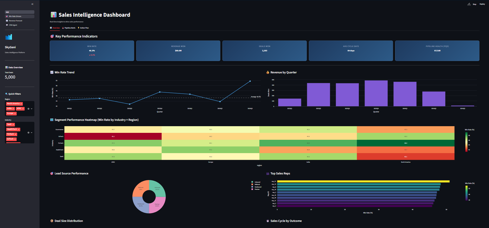
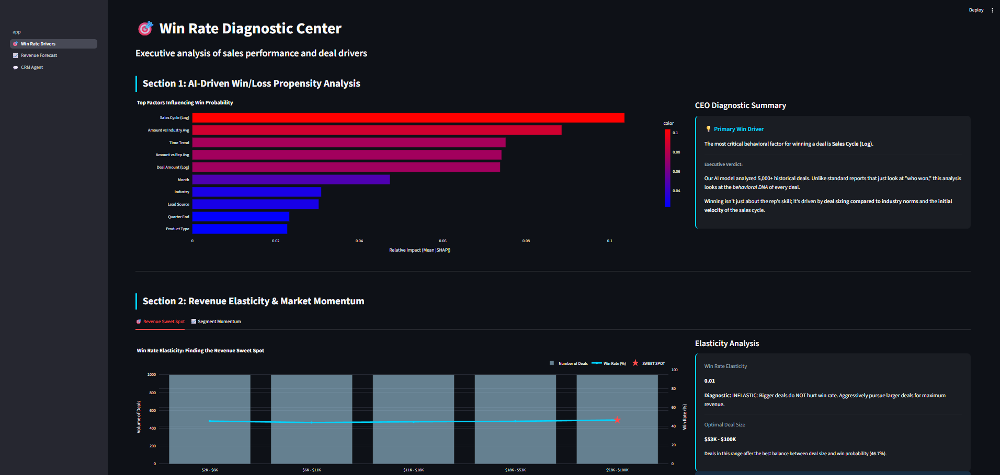
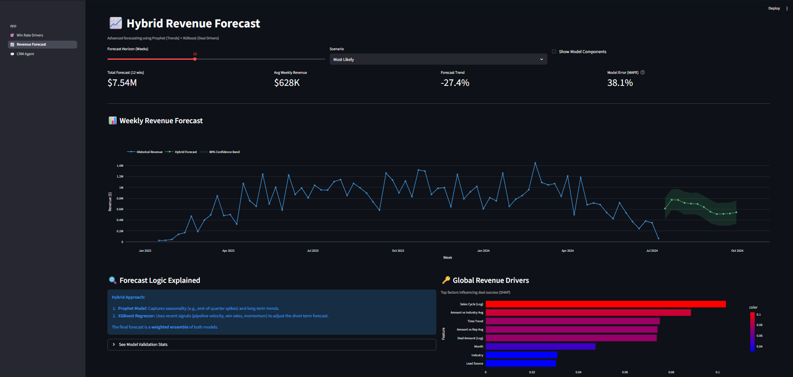
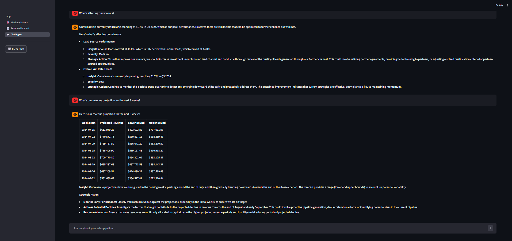

# SkyGeni Sales Intelligence Challenge

> **A Decision Intelligence System for B2B Sales Leaders**
>
> This solution investigates *why* win rates are declining, identifies *where* the problems are, predicts *what comes next*, and prescribes *what to do about it* — all through an interactive dashboard powered by custom metrics, ML models, and an AI conversational agent.

---

## 🚀 Quick Start

```bash
# 1. Clone and enter the project
cd skygeni
git clone https://github.com/Shaik1903/skygeni_assignment.git

# 2. Create virtual environment (recommended)
python -m venv venv
venv\Scripts\activate       # Windows
# source venv/bin/activate  # macOS/Linux

# 3. Install dependencies
pip install -r requirements.txt

# 4. Set up Gemini API key for AI-powered insights
#    Create a .env file in the project root and add:
echo "GOOGLE_API_KEY=your_actual_api_key_here" > .env
#    Replace 'your_actual_api_key_here' with your Google AI Studio API key
#    Get your key from: https://aistudio.google.com/app/apikey
#    
#    Without this, the system falls back to rule-based insights automatically.

# 5. Run the application
streamlit run app.py
```

Open your browser at `http://localhost:8501`. The dashboard has 4 pages accessible from the sidebar.

---

## ⚡ Fast Track: Jump Straight to the App

If you're too bored to go through the repo and just want to see the system in action:

1.  **Set up the environment:** `pip install -r requirements.txt`
2.  **Add the API key in .env file:** `GOOGLE_API_KEY=your_actual_api_key_here`
3.  **Launch the dashboard:** `streamlit run app.py`
4.  **Explore:** Navigate the sidebar to see the **Win Rate Drivers**, **Revenue Forecast**, and the **CRM Agent**.

---

## 📱 App Showcase

| Dashboard Overview | Win Rate Drivers |
|:--:|:--:|
|  |  |

| Revenue Forecast | CRM Agent (SkyRalph) |
|:--:|:--:|
|  |  |

### 🎬 Demo Video

 [DEMO VIDEO](sygeni_assignment_Demo_video.mp4)*

---

## 📂 Deliverables Overview

**All 5 parts of the assignment are complete. Here's where to find each deliverable:**

| Part | What to Review | Location |
|------|---------------|----------|
| **Part 1: Problem Framing** | Problem definition, metrics design, business context | [`docs/1_problem_framing.md`](docs/1_problem_framing.md) |
| **Part 2: Data Exploration** | EDA, insights, visualizations | [`notebooks/01_EDA_and_Data_Insights.ipynb`](notebooks/01_EDA_and_Data_Insights.ipynb) ⭐ \| [`docs/2_data_exploration.md`](docs/2_data_exploration.md) |
| **Part 3: Decision Engine** | All 4 engines (B, C, D) with code & results | [`notebooks/02_Decision_Engine.ipynb`](notebooks/02_Decision_Engine.ipynb) ⭐ \| [`docs/3_decision_engine.md`](docs/3_decision_engine.md) |
| **Part 4: System Design** | Architecture, data flow, production considerations | [`docs/4_system_design.md`](docs/4_system_design.md) |
| **Part 5: Reflection** | Assumptions, limitations, next steps | [`docs/5_reflection.md`](docs/5_reflection.md) |

**⭐ Start here:** Review the **notebooks** for a self-contained walkthrough with all code and visualizations, and the **[`docs/`](docs/)** folder for detailed technical framing, system design, and reflections. All generated visualizations are also available as high-resolution PNGs in the [`images/`](images/) folder for quick reference.

---

## 📐 Project Structure

```
skygeni_opus/
├── app.py                          # Main dashboard (Overview + Pipeline Alerts + Action Plan)
├── pages/
│   ├── 1_🎯_Win_Rate_Drivers.py    # Decision Engine B: SHAP-driven win/loss analysis
│   ├── 2_📈_Revenue_Forecast.py    # Decision Engine C: Prophet + XGBoost hybrid forecast
│   └── 3_💬_CRM_Agent.py          # SkyRalph: LangGraph ReAct agent for natural-language queries
├── src/
│   ├── data_loader.py              # Data ingestion, validation, preprocessing, feature engineering
│   ├── metrics.py                  # 4 custom metrics: PQS, WRE, SMI, DVI + auto-generated insights
│   ├── eda.py                      # Comprehensive EDA: trends, segments, reps, time patterns
│   ├── forecasting.py              # Hybrid forecast pipeline: Prophet + XGBoost + SHAP + Walk-forward CV
│   ├── llm_insights.py             # LLM-powered insights via Gemini 2.5 Flash (with graceful fallback)
│   └── agent/
│       ├── graph.py                # LangGraph ReAct agent with Gemini 2.5 Flash
│       └── tools.py                # Agent tools: metrics summary, forecasting, trend analysis, ad-hoc pandas queries
├── data/
│   └── skygeni_sales_data.csv      # 5,000+ deal records
├── notebooks/
│   ├── 01_EDA_and_Data_Insights.ipynb  # Walkthrough: EDA, custom metrics, charts
│   └── 02_Decision_Engine.ipynb        # Walkthrough: XGBoost, SHAP, Prophet, anomaly detection
├── docs/
│   ├── 1_problem_framing.md          # Part 1: Problem Framing
│   ├── 2_data_exploration.md         # Part 2: Data Exploration & Insights
│   ├── 3_decision_engine.md          # Part 3: Decision Engine (all 4 engines)
│   ├── 4_system_design.md            # Part 4: System Design
│   └── 5_reflection.md               # Part 5: Reflection
├── images/                         # Visualizations (EDA plots, Model Importance, Forecasts)
│   ├── eda/                        # Distribution, trend, and segment analysis plots
│   └── decision_engine/            # SHAP importance, Anomaly detection, and Forecast results
├── requirements.txt
└── README.md                       # ← You are here
```

---

## 📚 Submission: All 5 Parts

### Part 1 — Problem Framing ([Full Document](docs/problem_framing.md))

**The real problem isn't "declining win rates."** It's a lack of decision intelligence — the sales organization has data but no framework to translate it into action.

We identified three systemic failures:
1. **Volume ≠ Quality** — The pipeline looks "healthy" because it's full, but deals are larger, riskier, and converting poorly.
2. **Lagging indicators dominate** — The CRO sees win rate drop *after* it happens. They need leading indicators (velocity, aging, momentum).
3. **Aggregate averages mask segment crises** — Company-wide 40% win rate hides Region A at 55% and Region B at 20%.

We designed the system to answer questions at four tiers: **Diagnostic** (Why?), **Predictive** (Where next?), **Prescriptive** (Which deals need attention?), and **Strategic** (Where's our sweet spot?).

**We invented 4 custom metrics** (not standard ones):

| Metric | Purpose | Key Formula |
|--------|---------|-------------|
| **Pipeline Qualification Score (PQS)** | Are we wasting capacity on dead deals? | `50% × DQE + 30% × Stall Rate + 20% × Win Rate Gap` |
| **Win Rate Elasticity (WRE)** | Does chasing bigger deals hurt us? | Elasticity coefficient across deal size buckets |
| **Segment Momentum Index (SMI)** | Which segments are gaining/losing steam? | Composite of win rate + volume + size trends |
| **Deal Velocity Index (DVI)** | Revenue per day of sales effort | `(Deal Amount / Cycle Days)` normalized to median |

---

### Part 2 — Data Exploration & Insights ([Notebook](notebooks/01_EDA_and_Data_Insights.ipynb) | [Summary](docs/data_exploration.md))

**Primary deliverable:** [`01_EDA_and_Data_Insights.ipynb`](notebooks/01_EDA_and_Data_Insights.ipynb) — A self-contained notebook with all code, visualizations, and analysis inlined.

The analysis covers **7 automated modules**:

1. **Win Rate Trends** — Quarterly/monthly decomposition with trend direction detection and peak/trough identification
2. **Segment Performance** — Cross-tabulation across region, industry, product type with relative performance scoring
3. **Deal Characteristics** — Won vs. Lost comparison on deal size, sales cycle, with statistical testing
4. **Lead Source Analysis** — Conversion rates, volume, and revenue contribution by source
5. **Sales Rep Deep Dive** — Individual rep performance profiling with consistency scoring
6. **Time Pattern Analysis** — Seasonal patterns, day-of-week/month-of-year effects
7. **Auto-Generated Insights** — Rule-based insight engine that produces actionable business recommendations

**3+ Meaningful Business Insights** (examples from our analysis):

| # | Insight | Why It Matters | Action |
|---|---------|---------------|--------|
| 1 | Win rate drops from ~58% to ~31% as deal size crosses the $50K threshold | The team lacks skills or process for enterprise sales; chasing bigger deals is destroying win rate | Set deal size guardrails; create specialist enterprise team |
| 2 | 30% of pipeline deals exceed the statistical winning window (P75 of won deals' cycle) | These "zombie deals" consume rep capacity but have near-zero conversion probability | Weekly pipeline review to kill or escalate stalling deals |
| 3 | Two regions show declining SMI scores while others are stable | A localized problem (competitor, rep turnover) is dragging down company-wide metrics | Targeted investigation and territory rebalancing |

**The 4 custom metrics (PQS, WRE, SMI, DVI)** are detailed above and in [docs/problem_framing.md](docs/problem_framing.md).

---

### Part 3 — Decision Engine ([Notebook](notebooks/02_Decision_Engine.ipynb) | [Summary](docs/decision_engine.md))

**Primary deliverable:** [`02_Decision_Engine.ipynb`](notebooks/02_Decision_Engine.ipynb) — A self-contained notebook with complete implementation, training, evaluation, and results for all engines.

**We implemented ALL FOUR options** from the challenge, not just one:

#### Engine B: Win Rate Driver Analysis → `pages/1_🎯_Win_Rate_Drivers.py`

- **Model:** XGBoost Classifier (5-fold Stratified CV) on 11 engineered features
- **Explainability:** SHAP (TreeExplainer) for global and local feature importance
- **Feature Engineering:** Log transforms, expanding mean for leakage prevention, interaction features (deal size vs. industry average, deal size vs. rep average), temporal encoding
- **Output:** Interactive bar chart showing which behavioral factors (deal sizing, sales velocity, region) most impact win probability

#### Engine C: Revenue Forecast → `pages/2_📈_Revenue_Forecast.py`

- **Model:** Hybrid ensemble of **Prophet** (trend + quarterly seasonality) and **XGBoost Regressor** (lag features, pipeline-created leading indicators)
- **Validation:** Walk-forward cross-validation (not random split — respecting time ordering)
- **Output:** 12-week forecast with confidence bands, scenario modeling (Optimistic/Conservative), and model component visualization
- **User Controls:** Adjustable forecast horizon, scenario selection, component toggle

#### Engine D: Pipeline Anomaly Detection → `app.py` (Pipeline Alerts tab)

- **Method:** Z-score analysis on rolling averages (configurable window and sensitivity)
- **Scope:** Detects anomalies in win rate, deal count, average deal size, and sales cycle
- **Segment-Level:** Runs anomaly detection *within* each region and industry, not just overall
- **Output:** Color-coded alert cards with severity levels (High/Medium/Low), contextual data (historical vs. current rates), and trend visualization

#### Bonus: SkyRalph CRM Agent → `pages/3_💬_CRM_Agent.py`

- **Architecture:** LangGraph ReAct agent with Gemini 2.5 Flash
- **4 Agent Tools:**
  - `get_key_metrics_summary` — PQS, WRE, SMI, DVI in structured JSON
  - `get_revenue_forecast` — On-demand forecast generation
  - `explain_win_rate_trends` — EDA-powered trend analysis
  - `analyze_sales_data` — Ad-hoc pandas queries via `create_pandas_dataframe_agent` (natural language → Python → results)
- **Charting:** Agent can generate Plotly charts rendered inline in the chat UI
- **Use Case:** A CRO types "Why did APAC win rate drop?" and gets an instant, data-backed answer with charts

---

### Part 4 — System Design ([Full Document](docs/system_design.md))

The system uses a three-layer architecture:

1. **Data Layer:** CSV ingestion → validation → feature engineering (15+ derived features)
2. **Intelligence Layer:** Custom metrics + EDA engine + ML models + LLM insights (with rule-based fallback)
3. **User Layer:** Streamlit multi-page app + LangGraph conversational agent

Key design decisions:
- **Aggressive caching** (`st.cache_data`, `st.cache_resource`, session state) ensures sub-second UI after first load
- **Graceful degradation:** If Gemini API is unavailable, the system silently falls back to rule-based insights
- **Modular architecture:** Each module (metrics, EDA, forecasting, LLM) is independently testable and swappable

See [docs/system_design.md](docs/system_design.md) for architecture diagrams, data flow, example alerts, scheduling frequency, failure cases, and production scaling path.

---

### Part 5 — Reflection ([Full Document](docs/reflection.md))

**Weakest assumptions:**
- Historical patterns predict future outcomes (fragile if market has shifted)
- Sales cycle days = sales effort (no activity-level data available)
- Win rate ≈ deal quality (ignores revenue maximization)

**What would break in production:**
- New product lines crash the label encoder
- Small segments produce noisy momentum scores
- LLM output format varies despite low temperature

**Next month priorities:**
1. Causal "What-If" engine (DoWhy/EconML)
2. Real-time open pipeline deal scoring
3. User feedback loop on insights
4. External signal enrichment (competitor intel, intent data)

**Confidence ranking:** Custom Metrics (🟢 high) > EDA/Anomaly (🟢 high) > Win/Loss Model (🟡 moderate) > CRM Agent (🟡 moderate) > Revenue Forecast (🔴 low confidence for >8 weeks)

---

## 🤖 Meet SkyRalph: Your AI CRM Agent

The flagship feature of this system is **SkyRalph**, a conversational CRM agent built with LangGraph and Gemini 2.5 Flash. Instead of manually digging through reports, you can simply ask questions in plain English:

- *"Give me a summary of our performance"*
- *"What's affecting our win rate?"*
- *"What's our revenue projection for the next 8 weeks?"*
- *"Which industry has the highest average deal size?"*

#### SkyRalph doesn't just chat - he **acts**. He has direct access to our analytics engine, forecasting models, and raw sales data to provide instant, data-backed insights and reports.


---

## 🛠️ Tech Stack & Key Decisions

| Component | Technology | Why |
|-----------|-----------|-----|
| **Dashboard** | Streamlit | Fastest path to interactive analytics; native multi-page support |
| **Visualization** | Plotly | Rich interactivity (hover, zoom, click) essential for executive users |
| **Classification** | XGBoost + SHAP | Best-in-class for tabular data; SHAP provides interpretability that black-box models lack |
| **Forecasting** | Prophet + XGBoost | Prophet captures seasonality; XGBoost captures deal-level signals; ensemble is more robust than either alone |
| **LLM** | Gemini 2.5 Flash (via LangChain) | Low latency, structured output; LangChain provides tool-calling abstraction |
| **Agent** | LangGraph (ReAct) | Stateful, tool-calling agent with proper error handling and streaming |
| **Core** | Pandas, NumPy, scikit-learn | Industry standard for data manipulation and ML preprocessing |

**Key design principle:** *Interpretability over accuracy.* A sales leader needs to know *why* a forecast is down ("deal velocity dropped 10%") more than having a 2% better MAPE. This is why SHAP is central and why every metric includes a business interpretation.

---

## 📊 Dashboard Pages at a Glance

| Page | What It Shows | Key Interactions |
|------|--------------|------------------|
| **📊 Overview** | KPIs, win rate trends, revenue charts, heatmap, custom metrics spotlight, AI-generated insights | Region/Industry filters, tab switching |
| **🎯 Win Rate Drivers** | SHAP feature importance, WRE sweet spot, SMI momentum, strategic recommendations | Interactive charts, segment tabs |
| **📈 Revenue Forecast** | Historical + forecast chart with confidence bands, model validation, driver analysis | Forecast horizon slider, scenario selector, component toggle |
| **💬 CRM Agent** | Natural language chat with SkyRalph for ad-hoc analytics queries | Free-text input, data tables, markdown reports |
